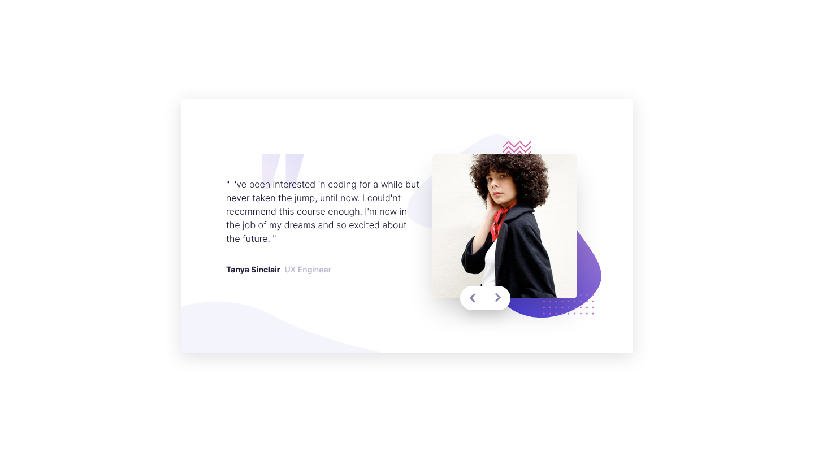

# Frontend Mentor - Coding bootcamp testimonials slider solution

This is a solution to the [Coding bootcamp testimonials slider challenge on Frontend Mentor](https://www.frontendmentor.io/challenges/coding-bootcamp-testimonials-slider-4FNyLA8JL). Frontend Mentor challenges help you improve your coding skills by building realistic projects. 

## Overview

### The challenge

Users should be able to:

- View the optimal layout for the component depending on their device's screen size
- Navigate the slider using either their mouse/trackpad or keyboard

### Screenshot

### Links

- Live Site URL: [Link](https://coding-bootcamp-testimonials-jet.vercel.app/)

## My process

### Built with

- Semantic HTML5 markup
- CSS custom properties
- Flexbox
- CSS Grid
- Mobile-first workflow
- [React](https://reactjs.org/) - JS library
- [Next.js](https://nextjs.org/) - React framework
- [Chakra](https://chakra-ui.com/) - For styles

## Author

- Website - [Personal Website](https://personal-portfolio-six-flax.vercel.app/)
- LinkedIn - [Emi Acerbi](https://www.linkedin.com/in/emiliano-acerbi-7a7141235/)

## Acknowledgments

Thanks to Frontend Mentor for the awesome challenge!

